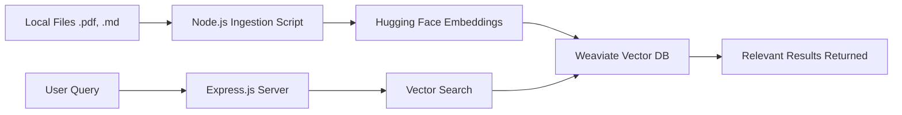

---

# Automated-Local-RAG-Insight-System (ALRIS) 🔍🧠

**ALRIS** is a high-performance, full-stack Retrieval-Augmented Generation (RAG) engine designed to transform your local file system into a searchable intelligence hub. Unlike traditional keyword search, ALRIS uses **Vector Embeddings** to understand the semantic meaning of your `.pdf`, `.md`, and `.txt` files.

Built with **Node.js**, **Weaviate**, and **Hugging Face**, this project demonstrates a private, local-first approach to AI-driven document retrieval.

---

## 🚀 Key Features

* **Deep Content Indexing:** Automatically reads and chunks data from multiple file formats.
* **Semantic Search:** Uses Hugging Face transformer models to find information based on *intent*, not just keywords.
* **Vectorized Storage:** Leverages Weaviate Cloud for ultra-fast high-dimensional vector similarity searches.
* **Modern UI:** A clean, responsive search interface built with Tailwind CSS.
* **Privacy Focused:** Keeps your data local; only processed vectors are sent to the cloud for retrieval.

---

## 🌟 Real-World Use Cases

Since ALRIS understands context rather than just matching words, it can be used for far more than a simple search bar:

* **📚 Personal Knowledge "Brain":** For students and researchers managing hundreds of PDFs. Ask: *"What are the three main criticisms of the paper on Quantum Computing I saved last month?"*
* **📁 Instant Technical Documentation Assistant:** Point ALRIS at your GitHub repositories' `/docs` folders. Ask: *"How do I configure the authentication middleware in our internal API?"*
* **⚖️ Legal & Contract Analysis:** Drop lease agreements or contracts into the `/data` folder. Ask: *"What is the notice period for terminating this contract, and are there any hidden fees?"*
* **✍️ Content Creation & Writing Partner:** Maintain consistency in your creative work. Ask: *"How did I describe the protagonist's childhood in the first three chapters?"*

---

## 🛠️ Tech Stack

* **Backend:** Node.js, Express.js
* **Database:** Weaviate (Vector Database)
* **AI/LLM:** Hugging Face Inference API (Embeddings & Text2Vec)
* **File Processing:** `pdf-parse`, `glob`, `fs`
* **Frontend:** HTML5, Tailwind CSS

---

## 📐 How It Works (RAG Architecture)



---

## 📂 File Structure

```text
Automated-Local-RAG-Insight-System/
├── data/                # Place your local documents here
├── src/
│   ├── index.js         # Express API & Search Logic
│   └── ingest.js        # File reading & Vectorization script
├── frontend/            # Tailwind-powered user interface
│   └── index.html       
├── .env                 # API Keys (Hugging Face & Weaviate)
├── .gitignore           # Secret management
└── package.json         # Dependencies

```

---

## ⚙️ Installation & Setup

### 1. Clone the repository

```bash
git clone https://github.com/saadxsalman/Automated-Local-RAG-Insight-System.git
cd Automated-Local-RAG-Insight-System

```

### 2. Install Dependencies

```bash
npm install

```

### 3. Environment Variables

Create a `.env` file in the root and add your credentials:

```env
HUGGINGFACE_API_KEY=your_hf_token
WEAVIATE_URL=your_weaviate_cluster_url
WEAVIATE_API_KEY=your_weaviate_api_key

```

### 4. Index Your Files

Place your documents in the `/data` folder, then run the ingestion script:

```bash
node src/ingest.js

```

### 5. Launch the System

```bash
node src/index.js

```

Open `http://localhost:3000` in your browser.

---

## 🛠️ Roadmap & Challenges Overcome

* [x] **File Parsing:** Implemented `pdf-parse` to handle binary PDF formats alongside text.
* [x] **Chunking Strategy:** Implemented fixed-size character chunking to ensure optimal vector embedding quality.
* [x] **Metadata Preservation:** Integrated file creation dates and extensions into the Weaviate schema.
* [ ] **Watch Folder:** Implement `chokidar` to automatically run `ingest.js` when new files are dropped into `/data`.
* [ ] **Chat History:** Save conversation logs to a local JSON file for session persistence.
* [ ] **Source Citations:** Update the UI so clicking a source card opens the local file to the correct page/section.

---

## 📄 License

Distributed under the MIT License. See `LICENSE` for more information.

---

Developed with ❤️ by [**Saad Salman**](https://www.google.com/search?q=https://github.com/saadxsalman)

---