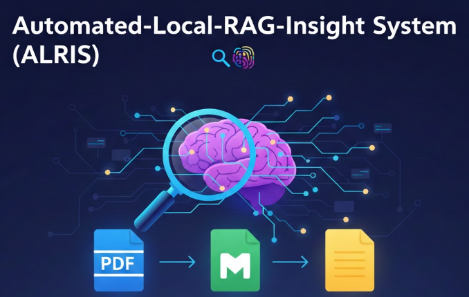

<p align="center">

</p>

# Automated-Local-RAG-Insight-System (ALRIS) 🔍🧠

**ALRIS** is a high-performance, full-stack Retrieval-Augmented Generation (RAG) engine designed to transform your local file system into a searchable intelligence hub. By leveraging **Vector Embeddings**, ALRIS understands the semantic intent behind your queries rather than relying on simple keyword matching.

Built with **Node.js**, **Weaviate**, and **Hugging Face**, this project offers a private, local-first approach to AI-driven document retrieval and analysis.

---

## 🚀 Key Features

* **Multi-Format Ingestion:** Seamlessly processes `.pdf`, `.md`, and `.txt` files using `pdf-parse`.
* **Semantic Intelligence:** Powered by Hugging Face `sentence-transformers` for high-accuracy vector embeddings.
* **Vectorized Storage:** Uses Weaviate for lightning-fast similarity searches and metadata management.
* **Modern Dashboard:** A professional **Next.js** frontend with a responsive, dark-mode UI and Lucide icons.
* **Privacy-Centric:** Your raw data stays local; only anonymized vectors are used for indexing.

---

## 🌟 Real-World Use Cases

Since ALRIS understands context rather than just matching words, it can be used for far more than a simple search bar:

* **📚 Personal Knowledge "Brain":** For students and researchers managing hundreds of PDFs. Ask: *"What are the three main criticisms of the paper on Quantum Computing I saved last month?"*
* **📁 Instant Technical Documentation Assistant:** Point ALRIS at your GitHub repositories' `/docs` folders. Ask: *"How do I configure the authentication middleware in our internal API?"*
* **⚖️ Legal & Contract Analysis:** Drop lease agreements or contracts into the `/data` folder. Ask: *"What is the notice period for terminating this contract, and are there any hidden fees?"*
* **✍️ Content Creation & Writing Partner:** Maintain consistency in your creative work. Ask: *"How did I describe the protagonist's childhood in the first three chapters?"*

---

## 📐 Architecture

The system follows a standard RAG pipeline:

1. **Ingestion:** Local files are read and split into manageable chunks.
2. **Embedding:** Chunks are sent to Hugging Face Inference API to generate 384-dimensional vectors.
3. **Storage:** Vectors and metadata are stored in a Weaviate "Document" class.
4. **Retrieval:** User queries are vectorized and compared against the DB using Cosine Similarity.

---

## 📂 File Structure

```text
Automated-Local-RAG-Insight-System/
├── backend/                # Your existing Express/Node.js logic
│   ├── data/               # Source documents (.pdf, .md, .txt)
│   ├── src/
│   │   ├── index.js        # Updated Express API with CORS
│   │   ├── ingest.js       # Ingestion script
│   │   └── weaviateClient.js
│   ├── .env                # Backend keys (WEAVIATE_API_KEY, HF_KEY)
│   └── package.json
│
├── frontend/               # The new Next.js application
│   ├── public/             # Static assets (logo, icons)
│   ├── src/
│   │   ├── app/            # App Router (Next.js 13/14/15+)
│   │   │   ├── layout.tsx  # Global fonts and metadata
│   │   │   ├── page.tsx    # The modern search UI (code provided earlier)
│   │   │   └── globals.css # Tailwind directives
│   │   ├── components/     # Reusable UI components (optional)
│   │   └── lib/            # Utility functions (API fetchers)
│   ├── .env.local          # Frontend vars (NEXT_PUBLIC_API_URL)
│   ├── next.config.js
│   ├── tailwind.config.js
│   └── package.json
│
├── README.md               # Documentation
└── .gitignore              # Ignores node_modules and .env files
```

---

## ⚙️ Installation & Setup

### 1. Prerequisites

* Node.js (v18+)
* A [Weaviate Cloud](https://console.weaviate.cloud/) Cluster (Free Tier works great!)
* A [Hugging Face](https://huggingface.co/settings/tokens) API Token.

### 2. Clone and Install

```bash
git clone https://github.com/saadxsalman/Automated-Local-RAG-Insight-System.git
cd Automated-Local-RAG-Insight-System

# Install Backend Dependencies
cd backend && npm install

# Install Frontend Dependencies
cd ../frontend && npm install

```

### 3. Environment Configuration

**Backend (`backend/.env`):**

```env
HUGGINGFACE_API_KEY=your_hf_token
WEAVIATE_URL=your_weaviate_cluster_url
WEAVIATE_API_KEY=your_weaviate_api_key
PORT=3001

```

**Frontend (`frontend/.env.local`):**

```env
NEXT_PUBLIC_API_URL=http://localhost:3001

```

### 4. Run the Engine

**Step A: Index your documents** (Ensure your files are in `backend/data`):

```bash
cd backend
node src/ingest.js

```

**Step B: Start the Backend Server:**

```bash
node src/index.js

```

**Step C: Start the Next.js UI:**

```bash
cd ../frontend
npm run dev

```

Visit `http://localhost:3000` to start querying.

---

## 🛠️ Tech Stack

* **Runtime:** Node.js
* **Backend:** Express.js
* **Frontend:** Next.js (React), Tailwind CSS
* **Vector Database:** Weaviate
* **Embeddings:** Snowflake: Arctic M v1.5

---

## 🌟 Use Cases

* **Research:** Search through hundreds of academic PDFs for specific concepts.
* **DevDocs:** Turn a folder of Markdown documentation into a searchable assistant.
* **Legal:** Analyze contracts and identify clauses based on context.

---

Developed with ❤️ by **[Saad Salman](https://www.google.com/search?q=https://github.com/saadxsalman)**
